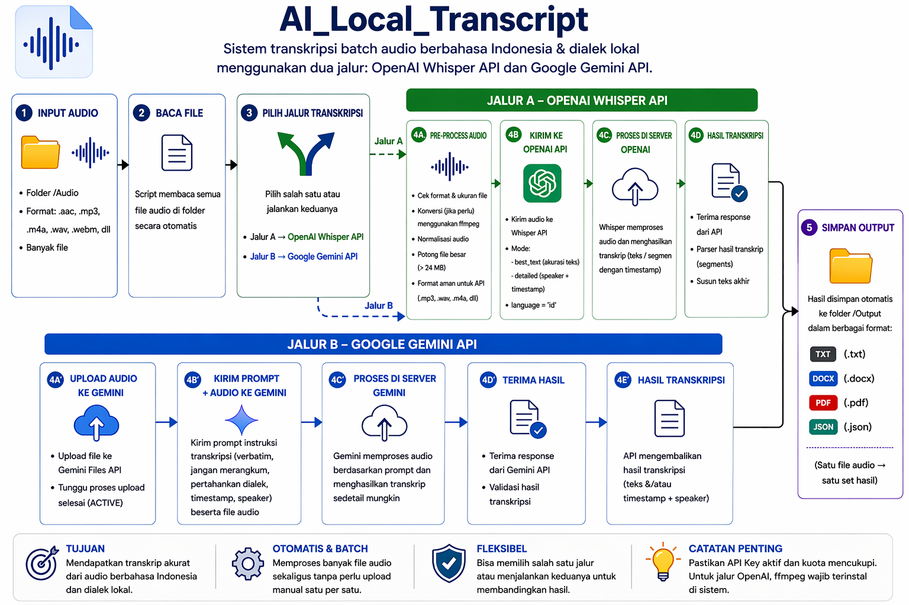

# Transkrip Audio Wawancara Lapangan

Repository ini menyediakan dua script Python untuk membantu proses transkripsi batch file audio wawancara lapangan ke beberapa format output. Proyek ini ditujukan untuk kebutuhan dokumentasi, penelitian, dan lampiran tugas akhir, terutama untuk audio berbahasa Indonesia yang dapat bercampur dengan dialek lokal.

<p align="center">
  
</p>

## Gambaran Umum

Terdapat dua jalur transkripsi yang dapat digunakan sesuai kebutuhan:

- **`transkrip_openaibase.py`**  
  Jalur transkripsi berbasis OpenAI Speech-to-Text. Cocok untuk pemrosesan batch dengan dukungan konversi file lokal, pemotongan audio berukuran besar, serta pilihan mode hasil yang lebih aman dibaca atau lebih detail.

- **`transkrip_googleaibase.py`**  
  Jalur transkripsi berbasis Google Gemini Files API. Cocok untuk pemrosesan batch audio dengan prompt transkripsi detail dan output multi-format.

Setiap file audio dapat menghasilkan output dalam format:
- `.txt`
- `.json`
- `.docx`
- `.pdf`

---

## Fitur Utama

### OpenAI Base
Script: `transkrip_openaibase.py`

Fitur utama:
- memproses banyak file audio dari satu folder
- mendukung dua mode hasil:
  - `best_text` → fokus pada hasil teks yang lebih aman dibaca
  - `detailed` → fokus pada speaker dan timestamp
- menangani file `.aac` dengan konversi ke format upload yang aman
- mendukung pemotongan file besar agar sesuai batas upload API
- mengecek ketersediaan `ffmpeg` sebelum konversi dan pemotongan
- menyimpan hasil per file dan hasil gabungan
- menyimpan log file yang gagal diproses

### Google AI Base
Script: `transkrip_googleaibase.py`

Fitur utama:
- upload file audio langsung ke Gemini Files API
- memproses batch file dari folder `Audio`
- menggunakan prompt untuk menghasilkan transkrip verbatim, detail, dan mempertahankan dialek lokal
- menyimpan hasil ke TXT, DOCX, PDF, dan JSON
- mendukung penggunaan `GEMINI_API_KEY` atau `GOOGLE_API_KEY` dari file `.env`

---

## Struktur Folder

```text
Transkrip/
  Audio/
  Hasil/
  .env
  .gitignore
  transkrip_openaibase.py
  transkrip_googleaibase.py
  README.md
```

Keterangan:
- `Audio/` → tempat file audio mentah
- `Hasil/` → hasil transkrip
- `.env` → tempat API key
- `.gitignore` → mencegah file sensitif ikut terunggah ke GitHub

---

## Persyaratan Sistem

- Python 3.9 atau lebih baru
- `ffmpeg` untuk jalur OpenAI
- API key yang valid untuk OpenAI atau Google Gemini

---

## Instalasi

### Dependensi untuk OpenAI
```bash
pip install openai python-dotenv pydub python-docx reportlab
```

### Dependensi untuk Google AI
```bash
pip install google-genai python-dotenv python-docx reportlab
```

---

## FFmpeg

`ffmpeg` dibutuhkan terutama untuk jalur OpenAI, khususnya saat file perlu dikonversi atau dipotong sebelum dikirim ke API.

Cek apakah `ffmpeg` sudah aktif:

```bash
ffmpeg -version
```

Jika command di atas belum dikenali, pastikan `ffmpeg` sudah terpasang dan sudah masuk ke `PATH`.

---

## Konfigurasi `.env`

### Opsi OpenAI
```env
OPENAI_API_KEY=isi_api_key_openai
```

### Opsi Google AI
```env
GEMINI_API_KEY=isi_api_key_google
```

Atau:

```env
GOOGLE_API_KEY=isi_api_key_google
```

> Jangan mengunggah file `.env` ke GitHub.

---

## Menjalankan Script

### Jalur OpenAI
```bash
python transkrip_openaibase.py
```

### Jalur Google AI
```bash
python transkrip_googleaibase.py
```

---

## Konfigurasi Penting

### OpenAI
Di dalam file `transkrip_openaibase.py`, mode default dapat diubah melalui:

```python
MODE = "detailed"
```

Pilihan yang tersedia:
- `best_text`
- `detailed`

Jika ingin hasil yang lebih fokus pada keterbacaan teks, ubah menjadi:

```python
MODE = "best_text"
```

### Google AI
Di dalam file `transkrip_googleaibase.py`, model default saat ini:

```python
MODEL_NAME = "gemini-2.5-flash"
```

Model dapat disesuaikan kembali sesuai kebutuhan dan ketersediaan kuota.

---

## Output

Setiap file audio akan menghasilkan output seperti:
- `nama_file.txt`
- `nama_file.json`
- `nama_file.docx`
- `nama_file.pdf`

Beberapa script juga membuat:
- file gabungan
- ringkasan proses
- log file yang gagal

---

## Troubleshooting

### 1. `ffmpeg` tidak dikenali
Penyebab umum:
- `ffmpeg` belum terpasang
- `ffmpeg` belum masuk ke `PATH`

Solusi:
- pasang `ffmpeg`
- buka terminal baru
- cek kembali dengan `ffmpeg -version`

### 2. `invalid_api_key`
Penyebab umum:
- API key salah
- file `.env` belum terbaca
- nama variabel environment tidak sesuai

Solusi:
- cek isi `.env`
- pastikan nama variabel benar
- pastikan file `.env` berada di folder proyek

### 3. `insufficient_quota` atau `RESOURCE_EXHAUSTED`
Penyebab umum:
- kuota API habis
- billing belum aktif
- limit model sudah tercapai

Solusi:
- cek dashboard billing dan usage
- gunakan model yang lebih ringan bila diperlukan
- ulangi proses setelah kuota tersedia

### 4. Hasil kosong
Penyebab umum:
- semua file gagal diproses
- API error
- `ffmpeg` belum tersedia
- kuota model habis

Solusi:
- cek log terminal
- cek file ringkasan proses
- uji satu file terlebih dahulu sebelum menjalankan batch penuh

---

## Keamanan

File berikut sebaiknya tidak diunggah ke GitHub:
- `.env`
- `Hasil/`
- `Audio/` jika file audio bersifat sensitif
- file output mentah hasil transkrip

Contoh `.gitignore` yang direkomendasikan:

```gitignore
.env
Hasil/
Audio/
__pycache__/
*.pyc
*.docx
*.pdf
*.json
*.txt
```

---

## Catatan Penggunaan

Script ini dibuat untuk membantu proses transkripsi wawancara lapangan secara lebih cepat dan terstruktur. Namun, pengecekan manual tetap disarankan, terutama jika audio mengandung:
- dialek lokal
- kebisingan latar
- tumpang tindih pembicara
- istilah lapangan yang spesifik

Untuk hasil akhir yang digunakan dalam dokumen resmi, lampiran penelitian, atau tugas akhir, revisi manual tetap diperlukan agar isi transkrip lebih akurat dan konsisten.

---

## Lisensi

Silakan sesuaikan dengan kebutuhan.

Jika repository ini digunakan untuk keperluan pribadi, penelitian, atau tugas akhir, lisensi dapat ditambahkan kemudian sesuai kebutuhan, misalnya MIT License atau lisensi internal.
